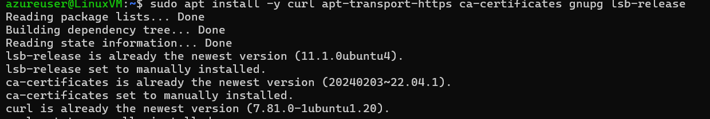
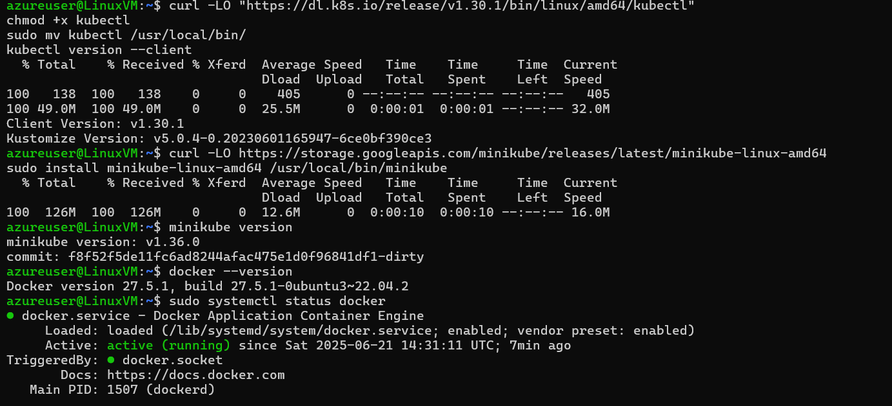
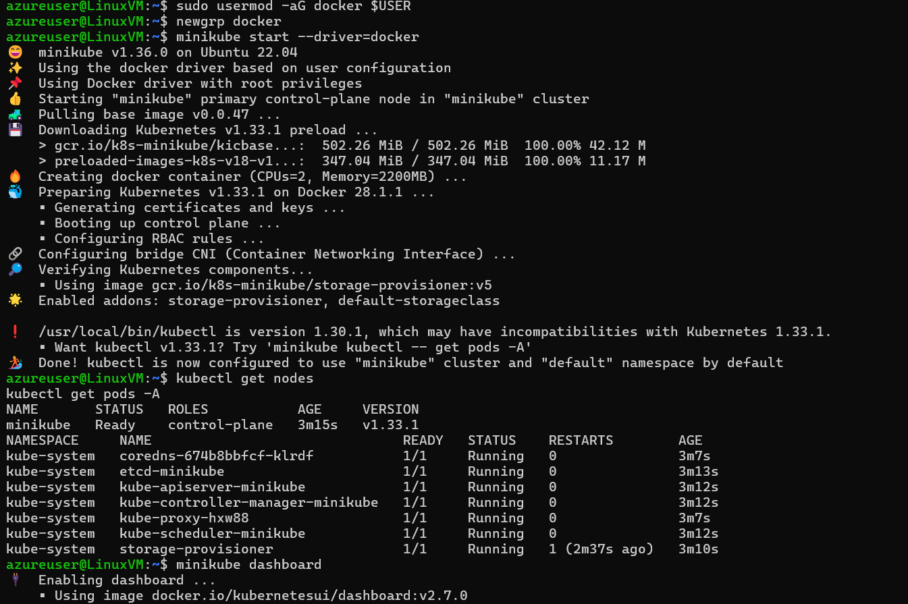
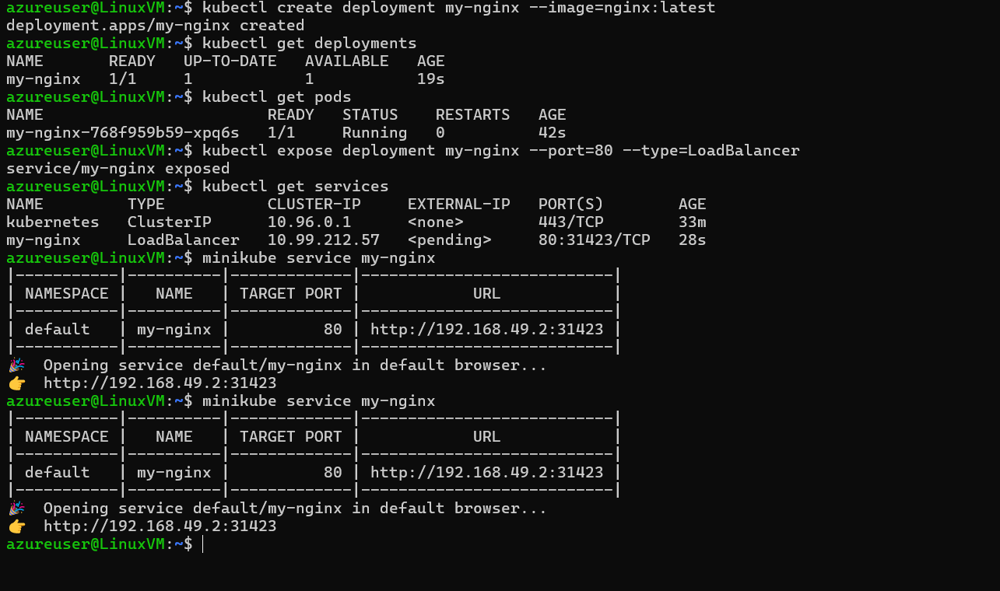
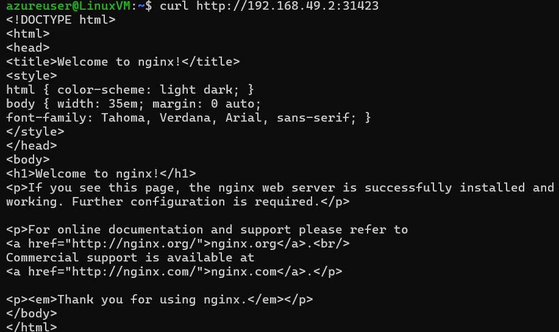

#  Task 1: Create a Kubernetes Cluster using Minikube (on Azure Ubuntu VM)

##  Objective:
Set up a single-node Kubernetes cluster using **Minikube** on an **Azure Ubuntu VM**, and deploy a sample **NGINX** application to verify that the cluster is functioning correctly.

---

##  VM Environment

| Setting          | Value                         |
|------------------|-------------------------------|
| Cloud Provider   | Microsoft Azure               |
| OS               | Ubuntu 22.04 LTS              |
| VM Size          | Standard B2s (2 vCPU, 4 GB)   |
| Access Method    | SSH from local machine        |

---

##  Tools Installed

| Tool      | Version        |
|-----------|----------------|
| Docker    | 27.5.1         |
| kubectl   | v1.30.1        |
| Minikube  | v1.36.0        |

---

##  Step-by-Step Setup

###  1. Install Docker

```bash
sudo apt update
sudo apt install -y docker.io
sudo systemctl enable docker
sudo systemctl start docker
```

Add your user to the Docker group:

```BASH
sudo usermod -aG docker $USER
newgrp docker
docker run hello-world
```

###  2. Install kubectl
```bash

curl -LO "https://dl.k8s.io/release/v1.30.1/bin/linux/amd64/kubectl"
chmod +x kubectl
sudo mv kubectl /usr/local/bin/
kubectl version --client
```

### 3. Install Minikube
```bash
curl -LO https://storage.googleapis.com/minikube/releases/latest/minikube-linux-amd64
sudo install minikube-linux-amd64 /usr/local/bin/minikube
minikube version
```

### 4. Start Minikube Cluster
```bash

minikube start --driver=docker
```

### 5. Verify Cluster
```bash

kubectl get nodes
kubectl get pods -A
```

 Expected Output:

- Single node named minikube in Ready state

- System pods (kube-apiserver, kube-proxy, etc.) in Running state

##  Application Deployment & Exposure
### 1. Create NGINX Deployment
```bash
kubectl create deployment my-nginx --image=nginx:latest
kubectl get deployments
kubectl get pods
```

### 2. Expose it as a LoadBalancer Service
```bash
kubectl expose deployment my-nginx --port=80 --type=LoadBalancer
kubectl get services
```

Expected Output:

```bash
NAME         TYPE           CLUSTER-IP     EXTERNAL-IP   PORT(S)        AGE
my-nginx     LoadBalancer   10.99.x.x      <pending>     80:31423/TCP   ✅
```
### 3. Access the Service via Minikube
```bash
minikube service my-nginx
```

Expected Output:
```bash
👉  http://192.168.49.2:31423
```
Since this is an internal Minikube IP, it is only accessible from inside the VM.

To test the service from the VM:
```bash
curl http://192.168.49.2:31423
```
 You should see the HTML output of the NGINX Welcome Page.


## Summary:
Successfully created a single-node Kubernetes cluster using Minikube on an Azure Ubuntu VM. Verified the cluster with kubectl, deployed an NGINX sample app, exposed it using a LoadBalancer service, and accessed it using Minikube’s internal service URL.






